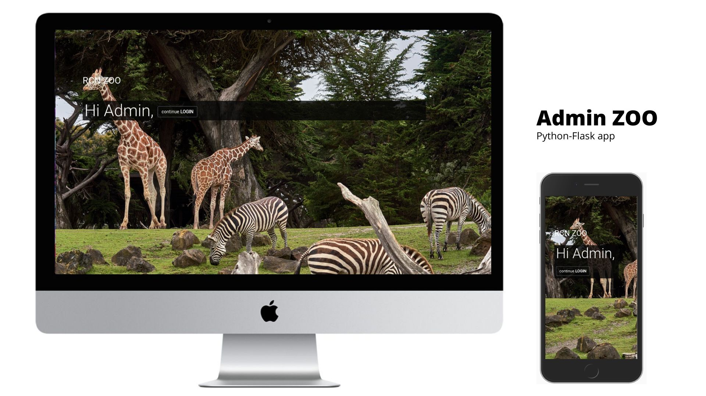

# Admin ZOO : Python-Flask app

### Live app Preview : [Admin ZOO](https://flask-python-zoo.herokuapp.com/)

The app is designed for administrator/s of fictional ZOO somewhere in the heart of island of Ireland who wish/es to easily manage info about animals stock currently in the ZOO.

# Table of Contents

- [Admin ZOO : Python-Flask app](#admin-zoo--python-flask-app)
    - [Live app Preview : Admin ZOO](#live-app-preview--admin-zoo)
- [Table of Contents](#table-of-contents)
  - [UX and Design](#ux-and-design)
    - [Wireframes](#wireframes)
    - [Design](#design)
    - [User Stories](#user-stories)
  - [Menu](#menu)
    - [Register](#register)
    - [Login](#login)
    - [All Animals View](#all-animals-view)
    - [Single Animal View](#single-animal-view)
    - [Account](#account)
    - [Create new animal](#create-new-animal)
    - [Update or Delete existing animal](#update-or-delete-existing-animal)
    - [Flash Messages](#flash-messages)
  - [Needs to be implemented](#needs-to-be-implemented)
  - [Technologies Used](#technologies-used)
- [Testing the app](#testing-the-app)
    - [Registration](#registration)
    - [Login](#login-1)
    - [Add Animal](#add-animal)
    - [Update Animal](#update-animal)
    - [Delete Animal](#delete-animal)
    - [All Animals page](#all-animals-page)
    - [Account page](#account-page)
  - [Credits](#credits)
  - [Deployment](#deployment)
    - [Local Deployment](#local-deployment)
    - [Instructions for deployement](#instructions-for-deployement)
    - [Heroku Deployment](#heroku-deployment)
  - [Notice](#notice)

 ## UX and Design
 

### Wireframes

The wireframes for the project, can be found [here](https://github.com/mariourban83/admin-zoo/tree/master/static/images)

### Design

- The app will be a fully functional administrator application with CRUD functionality. 
- Admin, after registering account , will be able to Login to Create (add) new, Read (list), Update (edit) existing or Remove (delete) animals to/from the database.
- Admin will be notified about performed CRUD actions on the page via flash messages
- Only logged in user will have acces to perform CRUD operations
- App will be fully responsive, but with the main focus on desktop user
- 

### User Stories

- As a user, I want navigation to be easy and clear to follow
- As a user, I want quickly find details I am looking for
- As a user, I want to be able to read info about each animal without logging in
- As an admin, to register, Registration form shouldn't be too long
- As an admin, I want to perform all CRUD operations on the page
- As an admin, I want to be notified about success or failure of my performed actions

## Menu 

App Menu, preferably created with Bootstrap should contain all important links including login/logout option for accesibility. There should be separate menus for large screens or mobile devices.

### Register

An user, administrator has to first register an account to be able to perform crud operations in the app. To register new account, username, email address and password must be provided. Username has to be between 5 to 20 and  password between 5 to 10 characters long.All fields are required to successfuly register an account.User gets notified  via error message when incorrect details are entered(wrong email format or password mismatch).When all details are correct and form validate on submit, user will be redirected to the home page.

### Login

After registering account, admin/s will be able to login with the case sensitive username and password they entered when they registered. When details entered are correct, after submiting the admin is redirected to the home page. If details are incorrect, not exactly case sensitive as details recorded, the admin gets warned with flash message.

### All Animals View
All animals should be displayed in a compact way, prefferably on a single page with searchbar for quick finding particular one animal when needed. Minimum info displayed for space saving, preferably name only with the link to the single page view where more details about animal are available. 

### Single Animal View

For single animal view page, all informations, if hold in the database, will be displayed in a simple for read  and clean way.There should be at least one picture of animal provided, either linked from web or uploaded directly to the server(or database). Link to the form for updating or deleting chosen animal must be displayed here. 

### Account

After creating accout, admin will have access to the account page where details like username, email or password change request will be displayed and ready for editing if necessary. Other data like last login or option for deleting account 
will be also provided here.

### Create new animal

For Creating new animal, clear link should be displayed on main/home page and in the menu for quick access. After landing on the page, form with marked fields will be displayed. In the form, required and optional fields should be displayed. More info entered here means more info displayed on the single view page.Option with adding additional field should also be available. Link back without for discarding data antered and returning back should also be available on the page.

### Update or Delete existing animal

To update or delete existing animal, link on home page and also in the menu will be displayed.This link will bring the admin to the all animal list view where clicking on single animal link, or picture will open single animal page view with Edit and Remove options visible and available. Also searchbar for even quicker access to the animal data should be available on all pages, excluding login and register pages.  

### Flash Messages

After performing actions on pages like login, registering, and also after CRUD operations, informative messages should be displayed to let admin know about success or failure of these actions.

## Needs to be implemented

Because of not enough time, I wasn able to complete:
- Session handling for authenticated user
- My account page
- Searchbar functionality
- Displaying modals for requested actions confirmation
- Logout function
- Flash messages disapearing
- Retrieve password over email
- Limit user registrations to 5 only.
- and others*

## Technologies Used

- Dravio design
- HTML and CSS
- Bootstrap4, jQuery and Popperjs
- Visual Studio Code
- Ubuntu CLI
- Python with Flask
- MongoDB with PyMongo and Mongo shell
- Heroku
    
# Testing the app

The app was set in debug=True mode during development for debugging the code. Pylint was actively helping me with the errors that appeared too.For responsivenes, design and functionality, chrome and firefox with dev tools were always used.

### Registration 

At the moment, multiple admins can register with same username. That is not the case for email.Email is checked after submit and if incorrect format or if already exists in db, red flash message will notify about that and user gets redirected back to register form page. 
Otherwise, after correct details entered, registration process sends encrypted password with data to the server for saving and I get redirected to the home page as expected.Green flash message is then displayed on the homepage about succesfull creation of the account

### Login

Login page allows only registered admins to log in. When details are entered, after submitting and comparing them with the data stored in the database, admin is redirected to home page and notified about succesful login.If username or password doesnt match with the records stored in database, I get redirected back to login page and red flash failure message gets displayed as expected. No logout button function at the moment.

### Add Animal

For adding animal, only 2 fields are required to submit at the moment, the name and link to the web image.I decided to make these 2 required only for proper displaying of animals on the list page. In order for data to be submited, these fields must be filled. Discard changes button included works as intended, redirect back to animal list without storing anything.

### Update Animal 

After clicking on the green edit icon on the single view page, I get redirected to the edit animal page where, if available in database, gets prepopulated with the data stored ready for updating.This works fine and here again, only two fields are required to be filled for animal data to be submited.

### Delete Animal

Clicking on the red bin icon, animal gets imediately removed from the database and I get redirected to the animals list page. In the future, modal confirm window before deleting animal will be implemented

### All Animals page

All animals page displays grid with: eye(preview)icon, name and image for each animal in a rounded picture style.This style is due the fact that all pictures are linked from the web at the moment and are of different size. Grid and images resize correctly and amount of displayed items depends on the  width of device used for viewing.

### Account page 

Account page isnt showing any information at the moment, but features like account info, update info, remove account and so on will be implemented in the feature.

## Credits

For each animal, data sources list ,if available, is displayed on single view animal page
Free Images used are from unsplash.com
Informations about animals and pictures ar going to be replaced after project assesment for more unique content.

## Deployment

### Local Deployment

For local deployement:

- Text, code editor prefferably
- Python with Pip
- Some form of virtual environment like pyenv, venv, conda or vagrant for environment separation
- Free tier Mongo Atlas Database acount for storing data
- Git for version control

### Instructions for deployement

1. Clone this repository to the folder of your choice in computer.Unzip if required.
2. Install virtualenv and activate
3. Use pip install requirements.txt to download, install dependencies and modules required for app to run
4. With MongoAtlas, create database and collections
5. After running : python app. py via terminal from virtualenv, the app should start and be available for preview via any browser on address : 
   - localhost:5000

6. The website can be visited on localhost, port 5000 at http://127.0.0.1:5000

### Heroku Deployment

1. Fork this repo to your github account.
2. In Heroku website, create project and link your forked repo in the deploy section.
3. In heroku app settings, add : IP -  0.0.0.0 and PORT - 5000 in the config var section.
4. Deploy the app
5. If successful, the app will start and be available online

## Notice

This project is intended for educational purposes only.